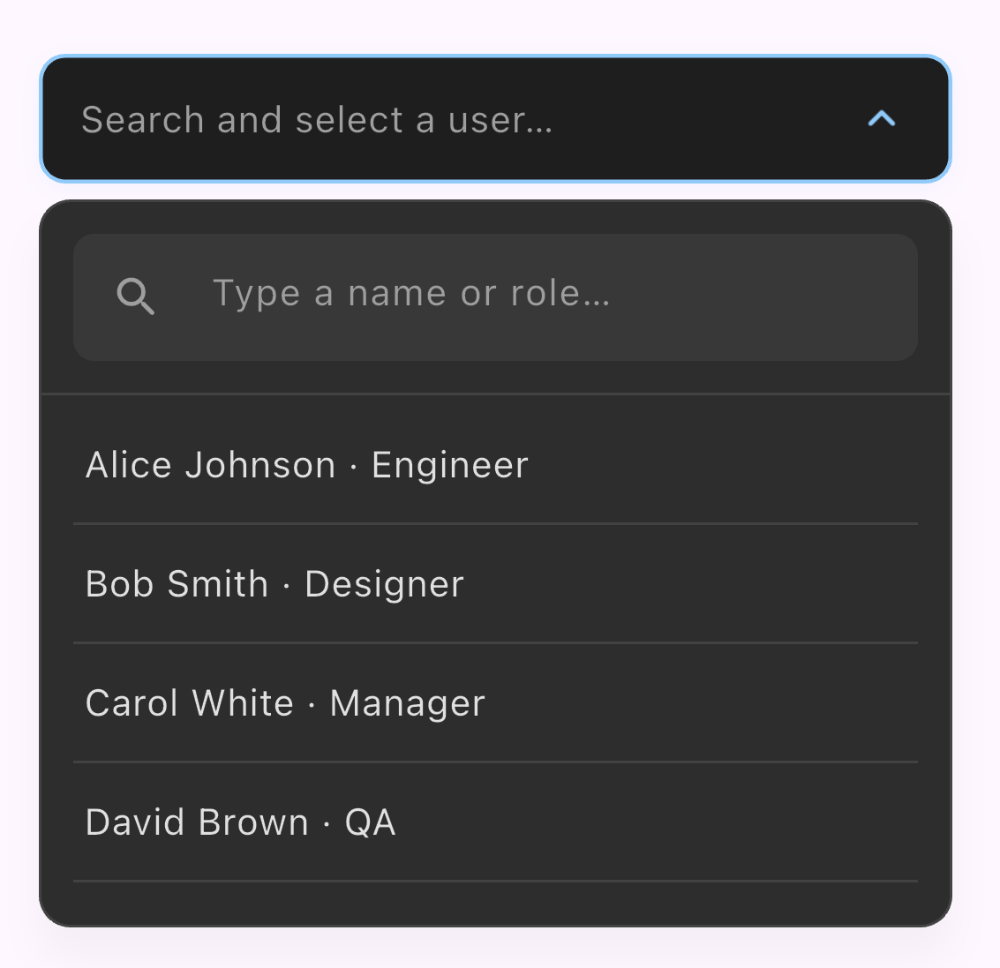
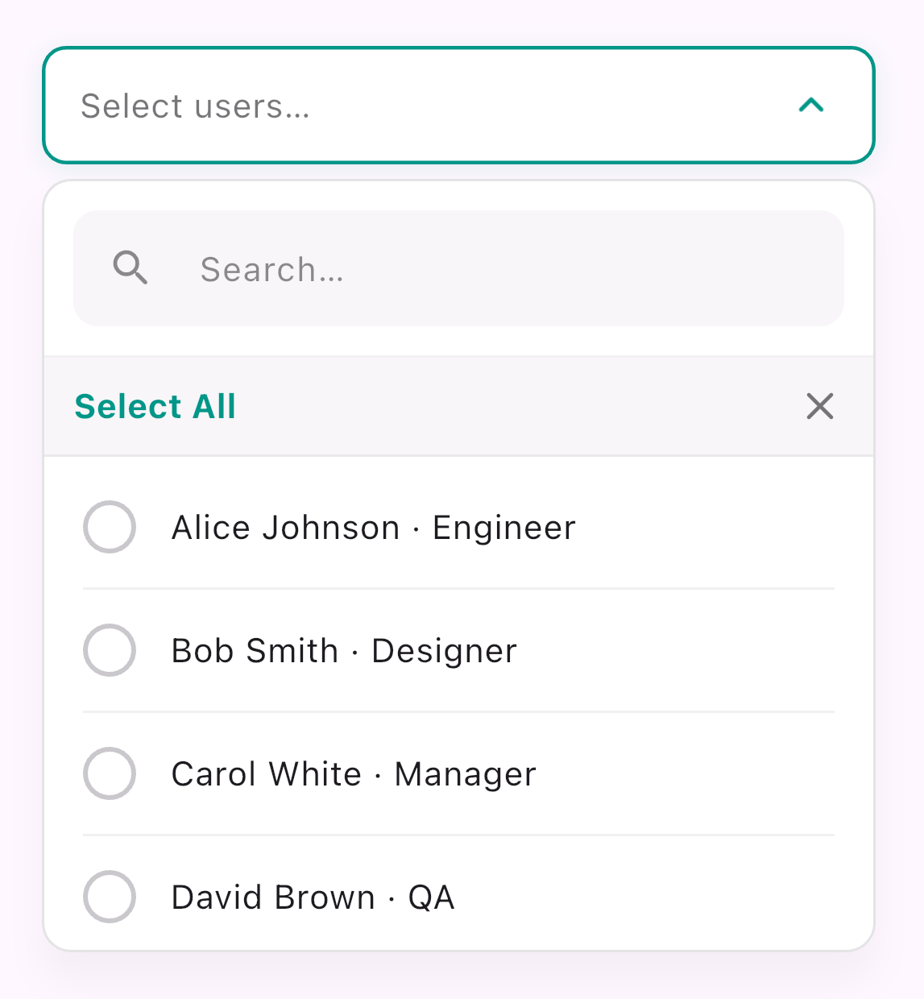
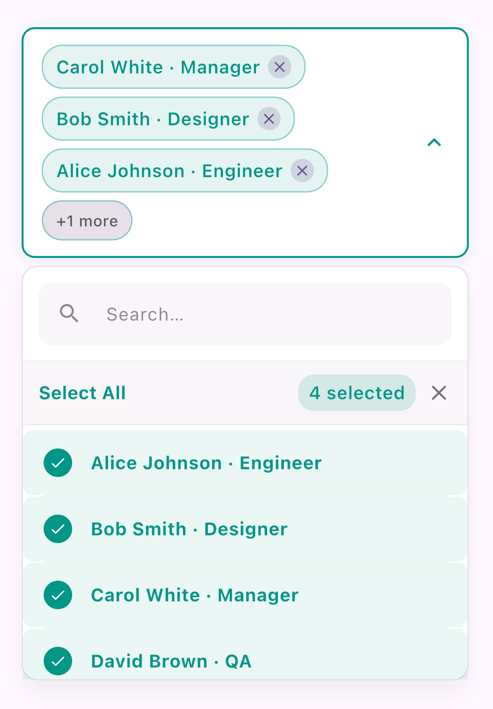

# dropdown_plus

[](https://pub.dev/packages/dropdown_plus)
[](https://opensource.org/licenses/MIT)

A highly customisable Flutter dropdown package with optional **BLoC / Cubit** integration. Use `*Plus` widgets with a cubit, or plain widgets with your own state.

| Widget | Description |
|--------|-------------|
| `SearchableDropdownPlus` | Single-select searchable dropdown (BLoC/Cubit) |
| `MultiSelectDropdownPlus` | Multi-select with chips (BLoC/Cubit) |
| `SearchableDropdown` | Single-select searchable dropdown (no BLoC — pass `items` / `isLoading`) |
| `MultiSelectDropdown` | Multi-select with chips (no BLoC — pass `items` / `isLoading`) |

---

## Features

- 🔌 **BLoC / Cubit integration** — `SearchableDropdownPlus` / `MultiSelectDropdownPlus` wire to any `Cubit` or `Bloc`
- 📦 **Plain StatefulWidget API** — `SearchableDropdown` / `MultiSelectDropdown` work with `setState`, Provider, Riverpod, etc.
- 🔍 **Real-time search** — calls your cubit's search method as the user types
- 📴 **Offline caching** — falls back to client-side filtering when no internet is available
- 🎨 **Preset + custom theming** — use `themeStyle` for out-of-the-box looks or `DropdownPlusTheme` for full control
- 🧩 **Custom builders** — override item rows, chip display, and the trigger button content
- 🔄 **Controlled mode** — sync selected value(s) from external state (e.g. QR scan, form reset)
- ✅ **Multi-select helpers** — "Select All" / "Clear All" header, "+N more" overflow chip
- 🎞 **Smooth animations** — animated open/close, arrow rotation, item selection

---

## Screenshots

### Single select


### Multi select
<p>
  
  &nbsp;
  
</p>

## Installation

Add to your `pubspec.yaml`:

```yaml
dependencies:
  dropdown_plus: ^0.1.0
  flutter_bloc: ">=8.0.0 <10.0.0"   # only transitive dep needed
```

Then run:

```bash
flutter pub get
```

---

## Quick Start

```dart
import 'package:dropdown_plus/dropdown_plus.dart';
```

### Single Select

```dart
SearchableDropdownPlus<WorkerCubit, WorkerState>(
  cubit: context.read<WorkerCubit>(),
  hintText: 'Search worker…',
  onSearch: (query) => context.read<WorkerCubit>().search(query),
  onStateChange: (state, updateList, updateLoading) {
    if (state is WorkersLoaded) {
      updateList(
        state.workers
            .map((w) => DropdownItem(value: w, label: w.name))
            .toList(),
      );
      updateLoading(false);
    } else if (state is WorkersLoading) {
      updateLoading(true);
    } else if (state is WorkersError) {
      updateLoading(false);
    }
  },
  onSelectionChanged: (item) {
    final worker = item.value as Worker;
    // use worker
  },
)
```

### Multi Select

```dart
MultiSelectDropdownPlus<WorkerCubit, WorkerState>(
  cubit: context.read<WorkerCubit>(),
  hintText: 'Select workers…',
  onSearch: (query) => context.read<WorkerCubit>().search(query),
  onStateChange: (state, updateList, updateLoading) {
    if (state is WorkersLoaded) {
      updateList(
        state.workers
            .map((w) => DropdownItem(value: w, label: '${w.name} (${w.id})'))
            .toList(),
      );
      updateLoading(false);
    } else if (state is WorkersLoading) {
      updateLoading(true);
    }
  },
  onSelectionChanged: (items) {
    final workers = items.map((e) => e.value as Worker).toList();
    // use workers
  },
)
```

### Without BLoC

Pass the current item list and loading flag from your own state. If `onSearch` is omitted, the search box filters **locally** over `items`. If `onSearch` is set, call your API and rebuild with updated `items` / `isLoading`.

**Single select**

```dart
SearchableDropdown(
  hintText: 'Search worker…',
  items: workers,
  isLoading: loadingWorkers,
  selectedValue: selectedWorkerItem,
  onSearch: (query) async {
    setState(() => loadingWorkers = true);
    final list = await api.searchWorkers(query);
    setState(() {
      workers = list.map((w) => DropdownItem(value: w, label: w.name)).toList();
      loadingWorkers = false;
    });
  },
  onSelectionChanged: (item) =>
      setState(() => selectedWorkerItem = item),
)
```

**Multi select**

```dart
MultiSelectDropdown(
  hintText: 'Select workers…',
  items: workers,
  isLoading: loadingWorkers,
  selectedItems: selectedWorkerItems,
  onSearch: (query) async {
    setState(() => loadingWorkers = true);
    final list = await api.searchWorkers(query);
    setState(() {
      workers = list.map((w) => DropdownItem(value: w, label: w.name)).toList();
      loadingWorkers = false;
    });
  },
  onSelectionChanged: (items) =>
      setState(() => selectedWorkerItems = items),
)
```

---

## Theme Customisation

Pass a `DropdownPlusTheme` to any dropdown widget (`*Plus` or plain) to change its appearance:

```dart
SearchableDropdownPlus(
  ...
  dropdownTheme: DropdownPlusTheme(
    // Trigger button
    backgroundColor: Colors.grey[100],
    borderColor: Colors.grey[300],
    activeBorderColor: Colors.deepPurple,
    borderRadius: 12,

    // Hint & text
    hintStyle: TextStyle(color: Colors.grey, fontSize: 14),
    triggerTextStyle: TextStyle(color: Colors.black87, fontWeight: FontWeight.w600),

    // Dropdown panel
    menuBackgroundColor: Colors.white,
    menuBorderRadius: 16,
    menuElevation: 8,
    menuMaxHeight: 280,

    // Search bar
    searchBarBackgroundColor: Colors.grey[50],
    searchHintStyle: TextStyle(color: Colors.grey),
    searchIconColor: Colors.grey,

    // Items
    itemTextStyle: TextStyle(color: Colors.black87),
    selectedItemTextStyle: TextStyle(color: Colors.deepPurple, fontWeight: FontWeight.bold),
    selectedItemBackgroundColor: Colors.deepPurple.withValues(alpha: 0.08),

    // Loading / empty
    loadingIndicatorColor: Colors.deepPurple,
    noResultsTextStyle: TextStyle(color: Colors.grey),
  ),
)
```

### Preset Theme Styles (`themeStyle`)

Use `themeStyle` when you want a ready-to-use UI without configuring every field:

```dart
SearchableDropdownPlus<WorkerCubit, WorkerState>(
  cubit: context.read<WorkerCubit>(),
  hintText: 'Search worker…',
  themeStyle: DropdownPlusThemeStyle.compact,
  onSearch: (query) => context.read<WorkerCubit>().search(query),
  onStateChange: (state, updateList, updateLoading) {
    // ...
  },
)
```

Available presets:

| Enum Value | Style |
|------------|-------|
| `DropdownPlusThemeStyle.material` | Default Material-like appearance |
| `DropdownPlusThemeStyle.minimal` | Light borders and subtle surfaces |
| `DropdownPlusThemeStyle.rounded` | Larger radius and softer card-like look |
| `DropdownPlusThemeStyle.outlined` | Strong border-focused style |
| `DropdownPlusThemeStyle.dark` | Dark surfaces with light foregrounds |
| `DropdownPlusThemeStyle.compact` | Dense spacing and smaller visuals |

You can also start from a preset and override specific properties:

```dart
MultiSelectDropdownPlus<WorkerCubit, WorkerState>(
  cubit: context.read<WorkerCubit>(),
  hintText: 'Select workers…',
  themeStyle: DropdownPlusThemeStyle.dark,
  dropdownTheme: DropdownPlusThemePresets
      .forStyle(DropdownPlusThemeStyle.dark)
      .copyWith(borderRadius: 16),
  onSearch: (query) => context.read<WorkerCubit>().search(query),
  onStateChange: (state, updateList, updateLoading) {
    // ...
  },
)
```

`dropdownTheme` takes precedence over `themeStyle` when both are provided.

### Dark Theme Example

```dart
dropdownTheme: DropdownPlusTheme(
  backgroundColor: const Color(0xFF1E1E2E),
  menuBackgroundColor: const Color(0xFF2A2A3E),
  borderColor: Colors.white12,
  activeBorderColor: Colors.blueAccent,
  hintStyle: TextStyle(color: Colors.white38),
  triggerTextStyle: TextStyle(color: Colors.white),
  itemTextStyle: TextStyle(color: Colors.white70),
  selectedItemTextStyle: TextStyle(color: Colors.blueAccent, fontWeight: FontWeight.w600),
  selectedItemBackgroundColor: Colors.blueAccent.withValues(alpha:0.15),
  dividerColor: Colors.white10,
  searchBarBackgroundColor: Colors.white10,
  searchHintStyle: TextStyle(color: Colors.white38),
  searchTextStyle: TextStyle(color: Colors.white),
  searchIconColor: Colors.white38,
  chipBackgroundColor: Colors.blueAccent.withValues(alpha: 0.2),
  chipTextStyle: TextStyle(color: Colors.blueAccent),
  chipBorderColor: Colors.blueAccent.withValues(alpha: 0.4),
  loadingIndicatorColor: Colors.blueAccent,
  checkboxActiveColor: Colors.blueAccent,
  headerBackgroundColor: const Color(0xFF252535),
  arrowIconColor: Colors.white54,
)
```

---

## `DropdownPlusTheme` Reference

| Property | Type | Default | Description |
|----------|------|---------|-------------|
| `backgroundColor` | `Color?` | `Colors.white` | Trigger button background |
| `borderColor` | `Color?` | `outline@50%` | Border colour when closed |
| `activeBorderColor` | `Color?` | `primary` | Border colour when open |
| `borderWidth` | `double` | `1.0` | Border width when closed |
| `activeBorderWidth` | `double` | `1.5` | Border width when open |
| `borderRadius` | `double` | `10.0` | Trigger corner radius |
| `contentPadding` | `EdgeInsets?` | `h14 v12` | Trigger inner padding |
| `hintStyle` | `TextStyle?` | `onSurface@60%` | Placeholder text style |
| `triggerTextStyle` | `TextStyle?` | `bodyMedium` | Selected value text style (single) |
| `menuBackgroundColor` | `Color?` | `Colors.white` | Panel background |
| `menuBorderRadius` | `double` | `12.0` | Panel corner radius |
| `menuElevation` | `double` | `12.0` | Panel shadow elevation |
| `menuMaxHeight` | `double` | `320.0` | Panel max height |
| `menuBorderColor` | `Color?` | `outline@20%` | Panel border colour |
| `searchBarBackgroundColor` | `Color?` | `surface@30%` | Search input container |
| `searchHintStyle` | `TextStyle?` | `onSurface@50%` | Search hint |
| `searchTextStyle` | `TextStyle?` | theme default | Search input text |
| `searchIconColor` | `Color?` | `onSurface@50%` | Search icon |
| `itemTextStyle` | `TextStyle?` | `onSurface 14sp` | Normal item text |
| `selectedItemTextStyle` | `TextStyle?` | `primary w500` | Selected item text |
| `selectedItemBackgroundColor` | `Color?` | `primaryContainer@30%` | Selected item row bg |
| `itemPadding` | `EdgeInsets?` | `h16 v12` | Item row padding |
| `dividerColor` | `Color?` | `outline@8%` | Divider between items |
| `checkboxBorderColor` | `Color?` | `outline@40%` | Circle checkbox border (unselected) |
| `checkboxActiveColor` | `Color?` | `primary` | Circle checkbox fill (selected) |
| `checkboxSize` | `double` | `22.0` | Circle checkbox diameter |
| `chipBackgroundColor` | `Color?` | `primary@10%` | Chip background |
| `chipTextStyle` | `TextStyle?` | `primary w500 12sp` | Chip text |
| `chipBorderColor` | `Color?` | `primary@30%` | Chip border |
| `chipBorderRadius` | `double` | `16.0` | Chip corner radius |
| `chipDeleteIconColor` | `Color?` | `primary` | Chip × icon colour |
| `chipDeleteIconSize` | `double` | `14.0` | Chip × icon size |
| `countChipBackgroundColor` | `Color?` | `surfaceContainerHighest` | "+N more" chip background |
| `countChipTextStyle` | `TextStyle?` | `onSurface@70%` | "+N more" chip text |
| `loadingIndicatorColor` | `Color?` | `primary` | Spinner colour |
| `loadingTextStyle` | `TextStyle?` | `onSurface@60% 13sp` | Loading message style |
| `noResultsTextStyle` | `TextStyle?` | `onSurface@60% 13sp` | No results message style |
| `noResultsIconColor` | `Color?` | `onSurface@40%` | No results icon colour |
| `arrowIconColor` | `Color?` | `onSurface@60%` | Caret icon colour |
| `arrowIconSize` | `double` | `22.0` | Caret icon size |
| `headerBackgroundColor` | `Color?` | `surface@30%` | Multi-select header row bg |
| `selectAllTextStyle` | `TextStyle?` | `primary w600 13sp` | "Select All" button style |
| `selectedCountTextStyle` | `TextStyle?` | `primary w600 11sp` | "N selected" badge text |
| `selectedCountBackgroundColor` | `Color?` | `primary@10%` | "N selected" badge bg |

---

## API Reference

### `SearchableDropdownPlus<C, S>`

| Parameter | Type | Required | Description |
|-----------|------|----------|-------------|
| `cubit` | `C` | ✅ | BLoC/Cubit instance |
| `onSearch` | `void Function(String)` | ✅ | Called on every search change |
| `onStateChange` | `void Function(S, updateList, updateLoading)` | ✅ | Maps state to list/loading updates |
| `hintText` | `String` | ✅ | Placeholder text |
| `selectedValue` | `DropdownItem?` | — | Pre-selected value (controlled mode) |
| `onSelectionChanged` | `void Function(DropdownItem)?` | — | User selection callback |
| `searchHint` | `String?` | — | Search input placeholder |
| `noResultsText` | `String?` | — | Empty-state message |
| `loadingText` | `String?` | — | Loading-state message |
| `needInitialFetch` | `bool` | — | Trigger search on mount (default: `false`) |
| `dropdownTheme` | `DropdownPlusTheme?` | — | Visual customisation |
| `themeStyle` | `DropdownPlusThemeStyle?` | — | Preset style (ignored when `dropdownTheme` is set) |
| `itemBuilder` | `Widget Function(item, isSelected)?` | — | Custom item row |
| `selectedValueBuilder` | `Widget Function(item)?` | — | Custom trigger content |
| `checkInternetConnection` | `Future<bool> Function()?` | — | Custom connectivity check |

### `MultiSelectDropdownPlus<C, S>`

All parameters from `SearchableDropdownPlus` plus:

| Parameter | Type | Default | Description |
|-----------|------|---------|-------------|
| `selectedItems` | `List<DropdownItem>` | `[]` | Pre-selected items (controlled) |
| `onSelectionChanged` | `void Function(List<DropdownItem>)?` | — | Selection change callback |
| `maxDisplayChips` | `int` | `2` | Max chips before "+N more" overflow |
| `selectedItemBuilder` | `Widget Function(List<DropdownItem>)?` | — | Custom chips display |
| `buttonHeight` | `double?` | — | Fixed trigger height |
| `buttonWidth` | `double?` | — | Fixed trigger width |

### `SearchableDropdown`

| Parameter | Type | Required | Description |
|-----------|------|----------|-------------|
| `hintText` | `String` | ✅ | Placeholder text |
| `items` | `List<DropdownItem>` | ✅ | Items to show (update from parent when search results change) |
| `isLoading` | `bool` | ✅ | Shows loading UI in trigger and panel when empty |
| `onSearch` | `void Function(String)?` | — | Remote search on each keystroke when online; omit for local-only filter |
| `selectedValue` | `DropdownItem?` | — | Controlled selection |
| `onSelectionChanged` | `void Function(DropdownItem)?` | — | User picked an item |
| `searchHint` | `String?` | — | Search placeholder |
| `noResultsText` | `String?` | — | Empty state text |
| `loadingText` | `String?` | — | Loading message |
| `needInitialFetch` | `bool` | — | If `true` and `onSearch` is set, calls `onSearch('')` on mount |
| `dropdownTheme` | `DropdownPlusTheme?` | — | Theme overrides |
| `themeStyle` | `DropdownPlusThemeStyle?` | — | Preset style |
| `itemBuilder` | `Widget Function(item, isSelected)?` | — | Custom row |
| `selectedValueBuilder` | `Widget Function(item)?` | — | Custom trigger when selected |
| `checkInternetConnection` | `Future<bool> Function()?` | — | Offline → local filter |

### `MultiSelectDropdown`

Same parameters as `SearchableDropdown`, plus:

| Parameter | Type | Default | Description |
|-----------|------|---------|-------------|
| `selectedItems` | `List<DropdownItem>` | `[]` | Controlled selection |
| `onSelectionChanged` | `void Function(List<DropdownItem>)?` | — | Selection changed |
| `maxDisplayChips` | `int` | `2` | Chips before "+N more" |
| `selectedItemBuilder` | `Widget Function(List<DropdownItem>)?` | — | Custom chip row in trigger |
| `buttonHeight` | `double?` | — | Fixed trigger height |
| `buttonWidth` | `double?` | — | Fixed trigger width |

---

## Offline Caching

Provide `checkInternetConnection` to enable offline fallback:

```dart
SearchableDropdownPlus(
  ...
  checkInternetConnection: () async {
    final result = await Connectivity().checkConnectivity();
    return result != ConnectivityResult.none;
  },
)
```

When offline, the widget performs client-side filtering on the cached item list instead of calling `onSearch`.

---

## Controlled Mode

Use `selectedValue` / `selectedItems` to sync selection with external state (e.g. form reset, QR scan):

```dart
// For QR scan — increment key to force re-sync
SearchableDropdownPlus(
  key: ValueKey(qrKey),
  selectedValue: scannedItem,
  ...
)
```

---

## Custom Builders

### Custom item row

```dart
SearchableDropdownPlus(
  ...
  itemBuilder: (item, isSelected) {
    final worker = item.value as Worker;
    return ListTile(
      leading: CircleAvatar(child: Text(worker.name[0])),
      title: Text(worker.name),
      subtitle: Text(worker.department),
      trailing: isSelected ? Icon(Icons.check, color: Colors.green) : null,
    );
  },
)
```

### Custom selected chips (multi-select)

```dart
MultiSelectDropdownPlus(
  ...
  selectedItemBuilder: (selected) => Text(
    selected.map((e) => e.label).join(' • '),
    overflow: TextOverflow.ellipsis,
  ),
)
```

---

## License

MIT © Lidhin
